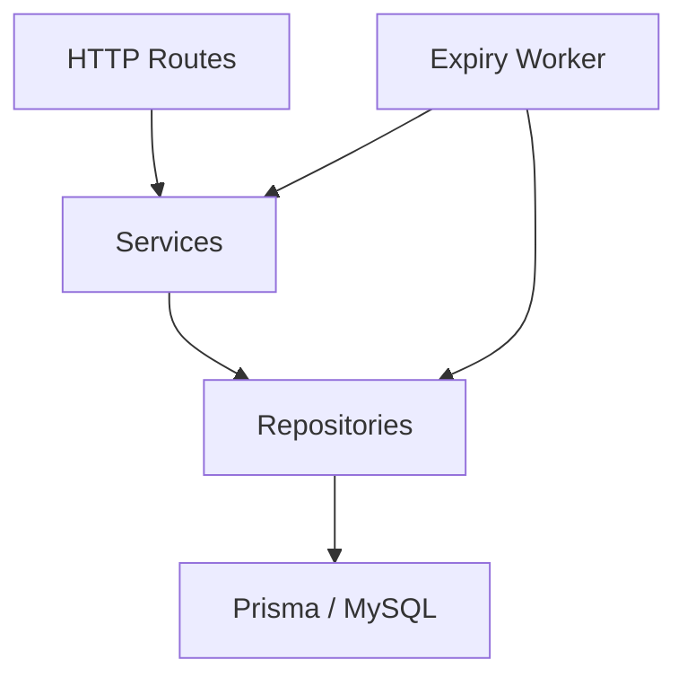
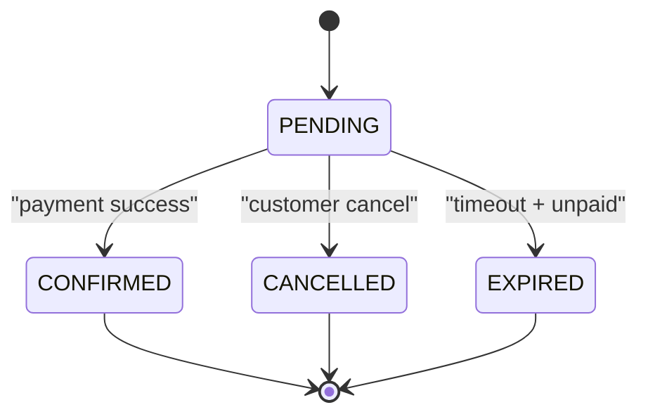
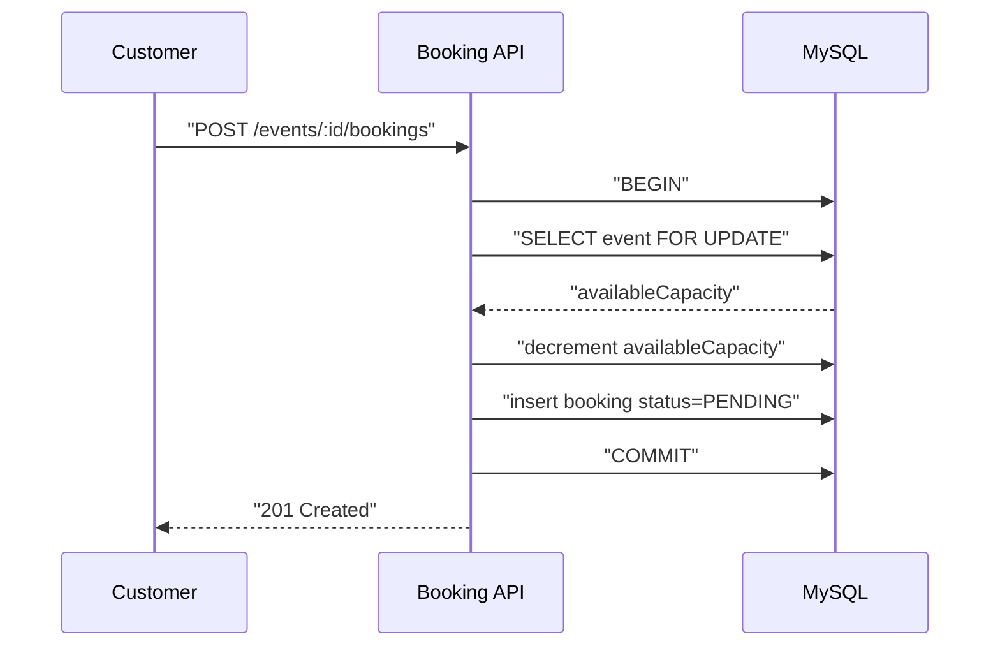
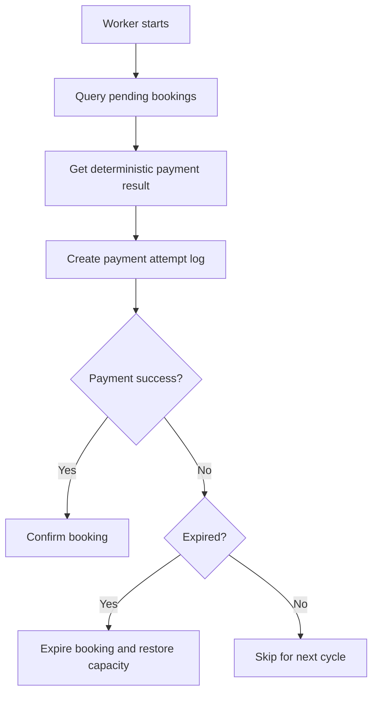

# Mimari Notlar

## Genel Bakış

Bu uygulama modüler monolith yaklaşımıyla geliştirilmiştir. HTTP API, domain servisleri, veri erişim katmanı ve arka plan worker'ı aynı kod tabanında yer alır; ancak sorumluluk sınırları ayrıdır.

Temel hedefler:

- rezervasyon kapasitesini güvenli yönetmek
- rol bazlı erişimi net ayırmak
- ödeme alınmayan rezervasyonları zamanında temizlemek
- küçük bir ekiple rahat okunabilir ve sürdürülebilir bir backend bırakmak

## Modüller

### `auth`

- kayıt
- giriş
- JWT üretimi
- auth middleware
- role guard

### `events`

- etkinlik oluşturma
- etkinlik listeleme ve detay
- güncelleme
- soft delete

### `bookings`

- rezervasyon oluşturma
- kullanıcının kendi rezervasyonlarını listeleme
- rezervasyon iptali
- kapasite güncelleme

### `payments`

- deterministik mock payment sonucu üretme
- mock payment sonucu dışa açan endpoint

### `jobs`

- bekleyen rezervasyonları tarayan worker
- payment sonucuna göre `CONFIRMED` veya `EXPIRED` kararı

## Katmanlar



## Dizin Yapısı

```text
src/
  app.ts
  server.ts
  config/
  common/
    errors/
    middleware/
    types/
    utils/
  modules/
    auth/
    events/
    bookings/
    payments/
  jobs/
  test/
prisma/
  schema.prisma
```

## Veri Modeli

### Users

- kullanıcı hesabı
- e-posta ve parola hash'i
- `ADMIN` veya `CUSTOMER` rolü

### Events

- etkinlik bilgileri
- toplam kapasite ve kalan kapasite
- aktif/pasif durum
- soft delete alanı

### Bookings

- `1 booking = 1 bilet`
- kullanıcı ve etkinlik ilişkisi
- `PENDING`, `CONFIRMED`, `CANCELLED`, `EXPIRED` durumları
- rezervasyon süresi için `expiresAt`

### PaymentAttempts

- her worker kontrolünde payment sonucu kaydı
- provider referansı
- payment payload özeti

## Rezervasyon Yaşam Döngüsü



## Booking Oluşturma Akışı

Rezervasyon akışında ana risk oversell üretmektir. Bunu önlemek için event satırı transaction içinde kilitlenir.



## Expiry Worker Akışı

Worker ayrı bir process olarak çalışır. Aynı kod tabanını paylaşır ama HTTP API'den bağımsız başlatılır.



## Tutarlılık Kararları

### Kapasite kontrolü

- booking oluşturma transaction içinde yürür
- event satırı `FOR UPDATE` ile kilitlenir
- kapasite yalnız veri tabanı içinde düşürülür

### Soft delete

- silinen etkinlikler public listede görünmez
- soft delete edilmiş etkinlik için yeni booking alınmaz

### İptal ve expire

- `PENDING` dışındaki booking'ler tekrar iptal edilemez
- expire edilen booking kapasiteyi geri verir
- worker terminal durumdaki booking'i tekrar değiştirmez

## Worker ve API Ayrımı

API ve worker ayrı entrypoint olarak tasarlanmıştır:

- `src/server.ts`
- `src/jobs/expiry-worker.ts`

Bu tercih şu faydaları sağlar:

- HTTP trafiği ile arka plan işini ayırır
- worker davranışını bağımsız başlatmayı kolaylaştırır
- ileride farklı process yönetimine geçişi kolaylaştırır

## Dağıtım Yaklaşımı

Bu proje düşük operasyonel karmaşıklıkla çalışabilecek şekilde hazırlanmıştır.

Tercih edilen kurulum:

- tek sunucuda API ve MySQL
- ayrı worker process
- daha ileri dağıtımlarda ters proxy ve process manager eklenebilir

Bu yapı küçük ekip ve kontrollü maliyet hedefi için yeterlidir. Daha yüksek ölçek ihtiyaçlarında uygulama ve veritabanı ayrı katmanlara ayrılabilir.

## Test Yaklaşımı

Uygulamada üç test seviyesi hedeflenmiştir:

- route testleri: auth ve event endpoint davranışları
- service testleri: booking domain kuralları
- worker testleri: payment sonucu ve timeout kararları

## Açık Sonraki Adımlar

- Swagger / OpenAPI dokümantasyonu
- Docker ve compose dosyaları
- EC2 üzerinde tek sunuculu dağıtım notları
- bonus olarak refresh token desteği
